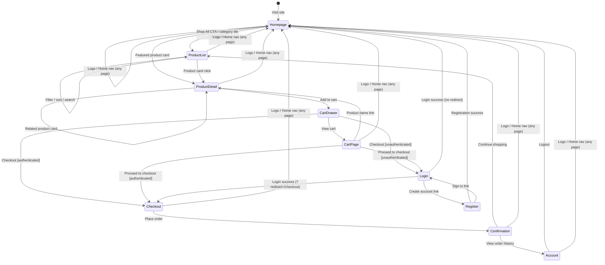
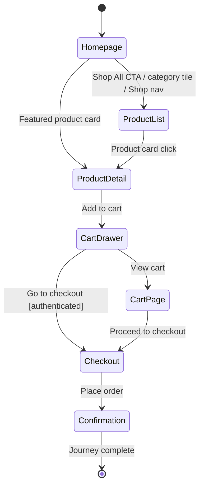
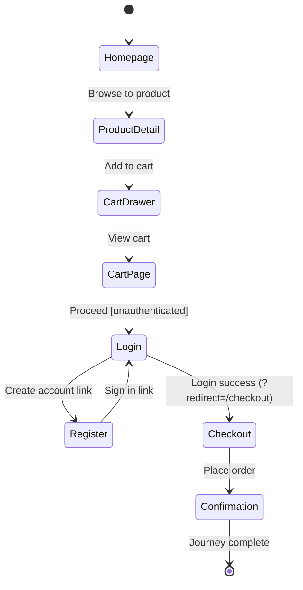
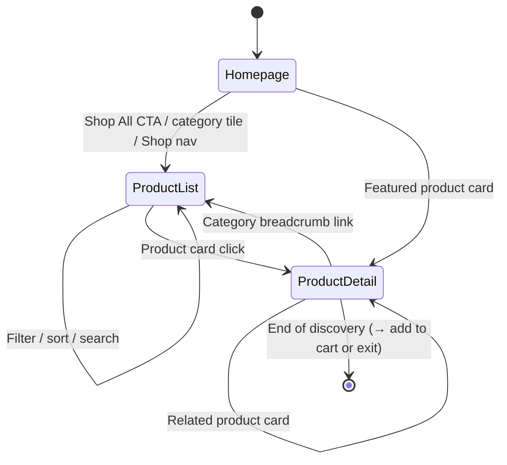

# State Transition Diagram — Northwind Goods App

---

## Key User Journeys

Three journeys worth testing end-to-end. Each exercises a distinct user goal and a different
code path. Anything not covered here (logo nav, sort/search loops, etc.) is either already
captured by lower-level tests or too low-value to justify a full E2E run.

---

### Journey 1 — Authenticated Purchase (core happy path)

The highest-value test in the suite. Covers browse → cart → checkout → confirmation without
any auth friction. If this breaks, the site cannot generate revenue.

---

### Journey 2 — Guest Purchase (auth gate + redirect)

Same purchase goal as Journey 1, but the user hits the auth gate. Tests that the redirect
round-trip (`?redirect=/checkout`) lands correctly after login and that registration feeds
back into the purchase funnel.

---

### Journey 3 — Browse & Discover

Covers the discovery path that feeds the funnel. Validates that filtering, category navigation,
and the product breadcrumb all lead users to the right product — and that the detail page
correctly reflects what was clicked.

---

## Auth guards

| Route | Unauthenticated |
|---|---|
| `/checkout` | Redirect to `/login?redirect=/checkout` |
| `/account` | Redirect to `/login` |

## Cart drawer

The cart drawer is an overlay (not a full page) triggered from the header cart button on any page. It provides shortcuts to `/cart` and `/checkout`.